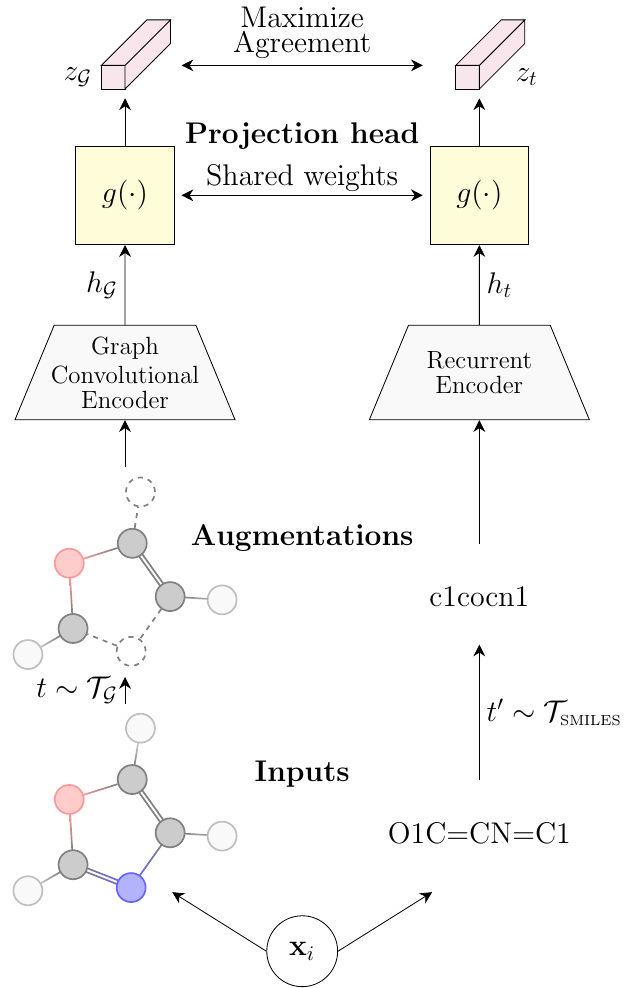

# SMICLR: Contrastive Learning on Multiple Molecular Representations for Semisupervised and Unsupervised Representation Learning
#### Authors: [Gabriel A. Pinheiro](https://scholar.google.com.br/citations?user=819H8Y8AAAAJ&hl=pt-BR&oi=ao), [Juarez L. F. Da Silva](https://scholar.google.com.br/citations?user=wQG1X8wAAAAJ&hl=pt-BR&oi=ao), [Marcos G. Quiles](https://scholar.google.com.br/citations?user=kQXxkc4AAAAJ&hl=pt-BR&oi=ao)
#### [Link to Paper](https://doi.org/10.1021/acs.jcim.2c00521)

### SMICLR

The official PyTorch implementation of SMICLR: Contrastive Learning on Multiple Molecular Representations for Semisupervised and Unsupervised Representation Learning. SMICLR jointly trains a graph encoder and an encoder for the simplified molecular-input line-entry system (SMILES) string to perform the contrastive learning objective.



#### Dependencies

We conducted the experiments using the libraries version described in the `requirements.txt` file.

#### Cite

Please cite [our paper](...) if you use this code in your own work:

```
@article{Pinheiro_2022_SMICLR,
  author = {Pinheiro, Gabriel A. and Da Silva, Juarez L. F. and Quiles, Marcos G.},
  title = {SMICLR: Contrastive Learning on Multiple Molecular Representations for Semisupervised and Unsupervised Representation Learning},
  journal = {Journal of Chemical Information and Modeling},
  volume = {62},
  number = {17},
  pages = {3948-3960},
  year = {2022},
  doi = {10.1021/acs.jcim.2c00521},
  note = {PMID: 36044610},
  URL = {https://doi.org/10.1021/acs.jcim.2c00521},
  eprint = {https://doi.org/10.1021/acs.jcim.2c00521}
}
